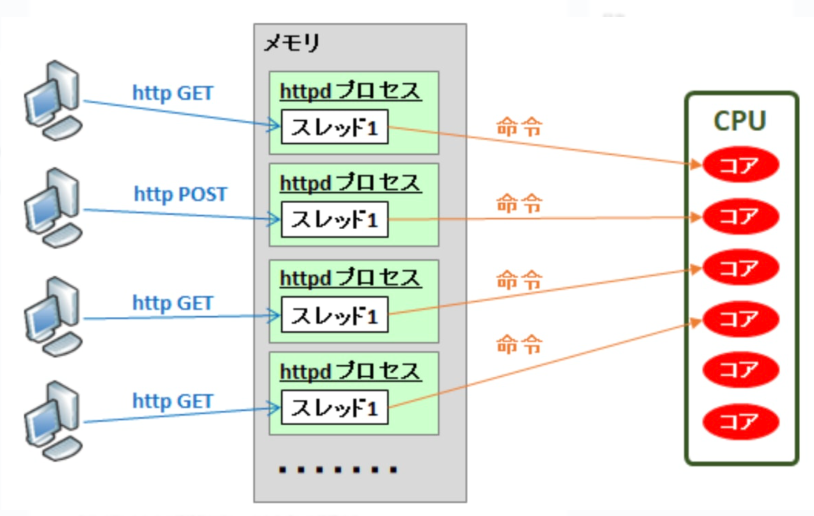
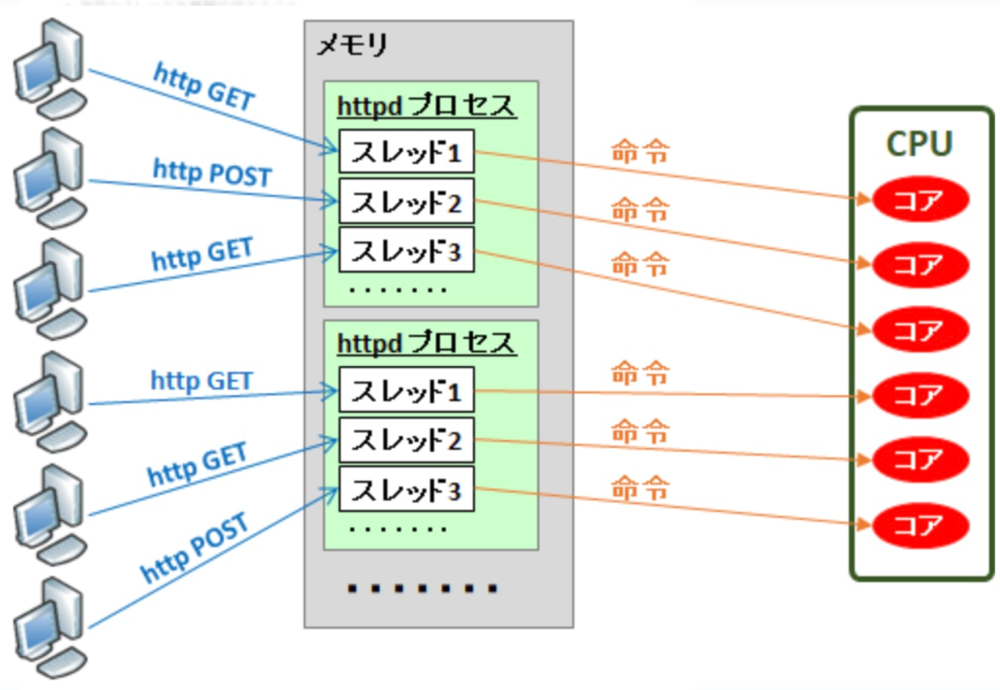

# プロセス

## プロセスとは

- 実行状態のアプリケーションはプロセスになる
- １つのプロセスには１つのメモリ領域が割りあてられる。
- プロセスが利用する情報はすべてメモリにロードされる。
- OS がどのプロセスに CPU（演算処理）を割り当てるかを請け負う
- プロセスが実行とは、CPU がプロセスに割り当てられたメモリのデータに対し、演算を行うこと
- CPU は一度に１プロセスしか処理ができない

つまり、プロセスとはプログラムの実行単位＝ CPU とメモリを使って演算する仕事の単位

### イメージ

windws のタスクマネーシャーで表示される１つのタスクがプロセスにあたる。

## プロセスのメモリ

プロセスはテキストセグメントとデータセグメントからなる構造デーをメモリ上に持つ

- テキストセグメント
  - プログラムの命令が置いてある
- データセグメント

  - ヒープ領域
    - 通常の変数
      - 当該領域は、動的にサイズが確保される。それは、プロセス次第でメモリの領域が増減されるのでプロセス実行時までサイズが不明なため
  - 静的領域

    - 定数やグローバル変数が置かれている

  - スタック領域
    - 一時的なデータの保管領域（引数やローカル変数など）

# 並行と並列の違い

## 並行（concurrent）

- 任意の時間時に１つの仕事のみを行うが、複数の仕事を切り替えることで、同時に実行すること
- こっちの仕事をして、「待ち」状態になったら、別の仕事に切り替え、また「待ち」状態になったらさらに別の仕事をする
- システムが複数の仕事を「実行状態」として保っている状態

## 並列(pararell)

- 任意時間時に複数の仕事を同時に実行すること
- 並列は並行を包含する

## コンテキストスイッチ

コンピューターが現在の実行中プロセスやスレッドから別のプロセス、スレッドへ制御を移す操作をすることをコンテキストスイッチという。
コンテキストスイッチはオーバーヘッドが大きい処理なので、頻発すると処理速度が低下する
コンテキストスイッチの発生場面

- プロセスやスレッドの実行中に、一定の実行時間が終了した時
- 割り込みが発生し、新しいタスクが実行される時（デバイスからの出入力が完了した時など）
- プロセスやスレッドが自発的に待機状態に入り、他のプロセスやスレッドが実行可能になったとき

## マルチプロセス

- 複数のプロセスを並列（同時処理）で処理する
- `クライアントからの接続ごとにプロセスをフォーク`（複製）して処理する。そのため、メモリ空間が相互影響しない
- プロセスをフォークして、子プロセスを複数立ち上げることでプログラムの並列実行を可能にしている。
- 子プロセスはフォースした際に、親プロセスのデータセグメントのみをコピーし、テキストセグメント（命令文）は親プロセスのものを参照する
  - デメリット
  - プロセスごとにメモリを食うので大量のプロセスができるとメモリの観点でパフォーマンスが悪化

図はクライアントからの接続ごとにプロセスがフォークされている

## シングルプロセス

- １つのプロセスでプログラム実行される
- プロセスは一つなので、並行処理となる

# スレッド

プロセスの中で動くそれぞれの処理
 
CPU を利用するための実行単位で、最小処理単位の概念
（プロセスが`プログラムの実行単位＝ CPU とメモリを使って演算する仕事の単位`に対し、スレッドは`CPU を利用するための実行単位で、最小処理単位の概念`
）

## マルチスレッド

- 複数のスレッドを並列処理（同時処理）すること
- `クライアントからの接続ごとにスレッド`を生成処理する
- 親プロセスからスレッドが生成される際に、親プロセスのスタック領域のみがコピーされる
- メリット
  - メモリ空間が各スレッド間で共有できる（同じプロセス内＝同じメモリ空間なので共有ができる）
  - マルチプロセスに比べて、メモリ空間の切り替えがないため、メモリ消費量やコンテキストスイッチのオーバーヘッドが小さい
- デメリット
  - メモリ領域を共有しているため、他のスレッドに依存する場合がある。スクリプト言語等が組み込めない場合もある？

図はクライアントからの接続ごとにスレッドが生成されている
 
※プロセスが２つ出ているのはマルチプロセスを意味するのではなく、単に２つアプリケーションが実行状態という意味

## シングルスレッド

- プログラムの処理の流れは１本
- 単一の命令の流れを逐一実行していく並行処理
- 1 つのプロセスが１つのスレッドしか持たない場合、スレッド＝プロセスになる

# web サーバーの稼働方式

1. prefork
2. worker
3. event driven

## prefork

- マルチプロセスで動いている
- apache のデフォルトアーキテクチャ
- 事前にプロセスをが立ち上がっており、リクエストを受け付けられるようになってる
- リクエストとプロセスが１対１の関係。そんため、prefork は`シングルスレッド`である
- 一つのプロセスが停止しても他のプロセスへ影響がないため、通信を継続できる
- リクエストがあるたびに子プロセスが増え、メモリのひっ迫につながるので C10K 問題につながる

## worker

- マルチプロセス
- リクエストとスレッドが１対１で紐づく関係。そのため worker は`マルチスレッド`である。
- プロセスは増減できるが、リクエストと１対１の関係ではないため、prefork よりもメモリ消費を抑えられる
- 1 つのプロセスを停止した場合、複数のスレッドも同時に影響をうけるため、prefork より通信が不安定になりやすい
- リクエストが増えるとスレッドが増えるので、こちらも C10K 問題につながる

## even driven

- マルチプロセス
- シングルスレッド
- Node.js と同様にイベントループ（シングルスレッドでループ処理をまわし、キューにたまったイベントを処理していく処理方式）が利用され、定義されたイベントをもとにプロセスやスレッドを増減させ、一定の数に保てることで C10K 問題を解決している

# プログラム実行方式(PHP)

プロセスはプログラムの実行単位であるが、その実態である PHP プログラムの実行はどのように起きているのか。
以下は、web サーバにおける PHP の実行方式

## モジュール方式

apache の拡張モジュールで PHP を実行している方式

##　 CGI 方式
PHP コードの実行を web サーバのプロセスと完全に別個で実行している
つまり、AP サーバー（PHP インタプリタ）が PHP を実行している

また、CGI 方式は php-cgi 方式と Script 方式の２つがある

### モジュールと CGI の違い

- モジュール版の実態
   
  PHP が Web サーバーのモジュールとして組み込まれている場合の一般的な挙動は以下の通り。
  Web サーバー上で PHP スクリプトを実行する際、スクリプトは Web サーバーのプロセスとして実行されます。このとき、PHP スクリプトは Web サーバーのユーザー ID（例えば、www-data や apache など）で実行される。そのため、ユーザー ID がわかってしまった場合、PHP アプリへの侵入が簡単なってしまう
   
- 詳細
   
  prefork MPM を使用する Apache においても、PHP は Apache の子プロセス内で実行されるため、Apache のプロセス管理の下で動作します。つまり、PHP リクエストが来るたびに新しい Apache の子プロセスが生成されるわけではなく、事前に生成されたプール内のプロセスがリクエストを処理します。

- CGI 版
   
  CGI、FastCGI、または PHP-FPM（FastCGI Process Manager）などの他の実行方法を使用することで、個々の PHP プロセスを異なるユーザー ID で実行することが可能になります。これにより、以下の利点が得られます。
   
  - セキュリティの向上:
     
    各 PHP アプリケーション（またはスクリプト）を異なるユーザー ID で実行することで、アプリケーション間のセキュリティ分離が強化されます。これは、特に複数の異なるユーザーまたはグループが管理するウェブサイトをホストする共有サーバー環境において重要です。
  - 柔軟なリソース管理:
     
    異なるアプリケーションに異なるリソース制限やアクセス権を設定できます。

## php-cgi

wab サーバーが PHP コードを php-cgi へ環境変数・引数付でなげ、そのじっく結果をクライアントへ応答する方式。

## Script 方式

PHP コードが実行形式となっており、web サーバーが PHP コードを外部実行しその実行結果をクライアントへ応答する方式

# FastCGI

php-fpm で利用されている

CGI は各リクエストごとに新しいプロセスを生成しそのあと終了するのに対し、FastCGI はプロセスが常駐し複数のリクエストを受け取ることができるため、オーバヘッドが少なくてすむ

#　 php-fpm（fastCGI prosece maneger）

PHP 実行方式の１つ
FastCGI プロトコルを介して web サーバーと通信し、PHP の処理を行うアプリケーションサーバー的な役割を果たすもの
